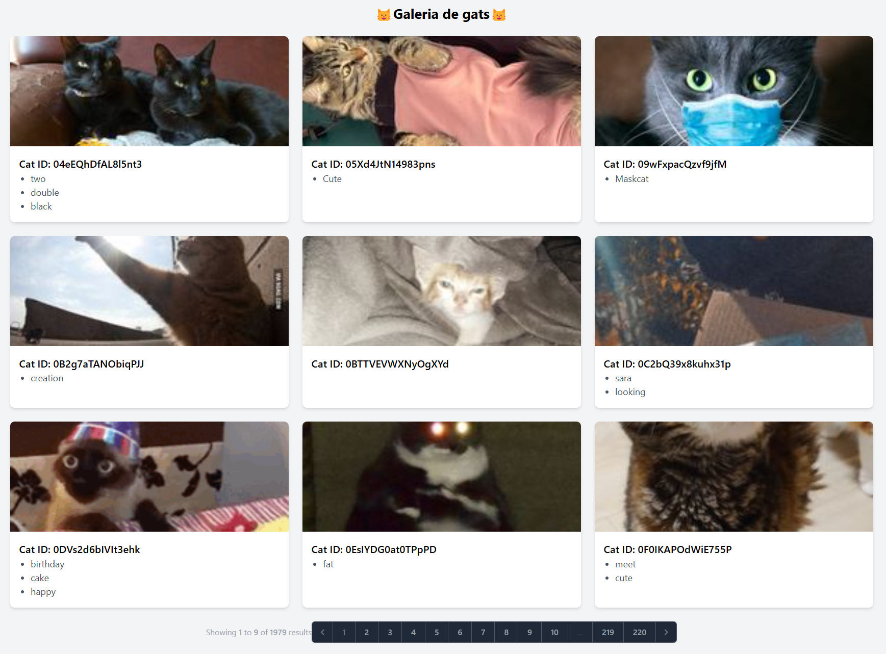

# 📌 Projecte Cataas

Aquest projecte ha estat desenvolupat amb l'objectiu de gestionar i visualitzar imatges de gats de manera eficient. Aquest projecte permet cercar, categoritzar i mostrar imatges de gats provinents de l'API de Cataas, i ha estat creat amb Laravel per a la gestió backend i Bootstrap per al disseny frontend.

## 📂 Base de dades

Hem utilitzat SQLite per emmagatzemar les dades necessàries. Les dades s'han importat mitjançant un `seeder` específic que carrega les categories i metadades de les imatges.

### 📌 Creació del model

Hem creat el model `Cataas` com a classe per importar i gestionar les dades. També hem implementat un `seeder` encarregat de carregar la informació inicial per facilitar les proves i l'ús del sistema.

## 🚀 Com executar el projecte

Per posar en marxa aquest projecte, segueix aquests passos:

### 1️⃣ Instal·lació de dependències

Abans de començar, assegura't de tenir instal·lades totes les dependències executant:

```sh
composer install
npm install
```

Això instal·larà totes les llibreries necessàries per al funcionament del projecte.

### 2️⃣ Configuració de la base de dades

Configura el fitxer `.env` amb les dades de connexió a la base de dades. Un exemple de configuració pot ser:

```
DB_CONNECTION=sqlite
DB_DATABASE=database/database.sqlite
```

Si no tens un fitxer `.env`, pots crear-lo a partir del fitxer `.env.example` executant:

```sh
cp .env.example .env
```

Després d'això, genera una clau d'aplicació única per a Laravel:

```sh
php artisan key:generate
```

### 3️⃣ Executar migracions i seeders

Abans d'executar els seeder, s'ha de crear un enllaç simbòlic a la carpeta "storage" des de la carpeta "public":

```sh
php artisan storage:link
```

Per executar les migracions i descarregar les imatges, executa el comandament següent:

```sh
php artisan migrate --seed
```

Això crearà les taules necessàries i descarregarà les imatges de l'API i les guardarà a "storage".

Si només vols executar les migracions sense descarregar les imatges, pots utilitzar:

```sh
php artisan migrate
```

I per refrescar completament la base de dades:

```sh
php artisan migrate:fresh --seed
```

### 4️⃣ Executar el servidor

Un cop tot estigui configurat, pots iniciar el servidor local de Laravel amb:

```sh
php artisan serve
```

El projecte estarà disponible a [http://127.0.0.1:8000](http://127.0.0.1:8000).

## 🔀 Rutes

Les rutes del projecte estan organitzades de la següent manera:

- `CatImageController@index`: Mostra la pàgina principal amb el llistat d'imatges.

## 📷 Captures de pantalla

### Pàgina d'inici amb les imatges i el selector de pàgines


## 🛠 Tecnologies utilitzades

Aquest projecte ha estat desenvolupat amb les següents tecnologies:

- Laravel 11.42.0
- PHP 8.2.12
- SQLite
- Bootstrap 5
